# Lebanese Red Cross Youth :hospital:

> The Lebanese Red Cross Youth (LRCY) is a private organization that is dedicated to promoting social awareness and community service among Lebanese citizens of various age groups. LRCY's mission is anchored in three distinct programs: Youth & Health, Human Values & Principles, and Environment. These programs are designed to equip young people with the skills and knowledge they need to make a meaningful impact on their communities and society as a whole.

  

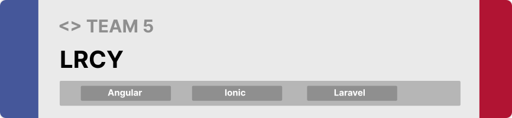

Hello world! This is our project for the software engineering course at LAU, the project was made for the Lebanese Red Cross Youth Sector in Jbeil.

**[PROJECT DESCRIPTION](#project-description) • [WIREFRAMES](#wireframe) • [TECH STACK](#tech-stack)  • [HOW TO RUN?](#how-to-run?)**

  
  

### Purpose of the Project :dart:
> This project aims to further enhance LRCY's outreach efforts through developing a mobile application and a websie that will streamline and optimize the daily tasks of its volunteers. This new application will enable volunteers to access a wide range of features, including yearly goals tracking, activity history, and training progress tracking. With the help of this innovative technology, LRCY will be better equipped to achieve its goals and empower more young people to make a positive difference in their communities.

### User Stories

- As a volunteer, I want to connect with other volunteers and express my self freely.
- As a volunteer, I want to check previous activities that I and others have been responsible of.
- As a volunteer, I want to check my yearly goals and track my progress.
- As a volunteer, I want to check my training and track my progress.
- As a volunteer, I want to check my statistics in the organizations.
- As a volunteer, I want to check the announcements sent by my superiors in the organization.
- As an admin, I want to add new volunteers to the organization.
- As an admin, I want to manage the volunteers in the organization.
- As an admin, I want to add activities to the gallery so other volunteers can check them.
- As an admin, I want to set yearly goals for the volunteers.
- As an admin, I want to send announcements to the volunteers.
    
    

> This design was planned before on paper, then moved to Figma for the fine details.   
> Note that we didn't use any already made template everything was made from scratch.

### Client App

| Splash Screen                          | Sign In                              | Sign Up         | 
| -------------------------------- | --------------------------------- | ------------------------ | 
|  | | 

| Register                                | Recover Request                            | Password Reset                            |                        
| ------------------------------------------- | ----------------------------------- | -------------------------------------------- | 
|  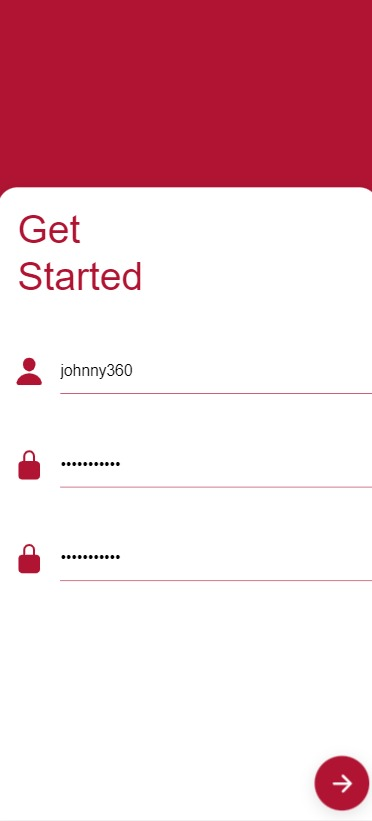 | 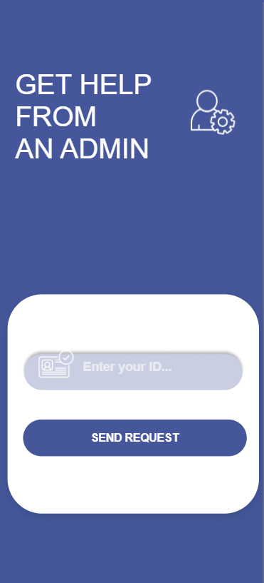 | 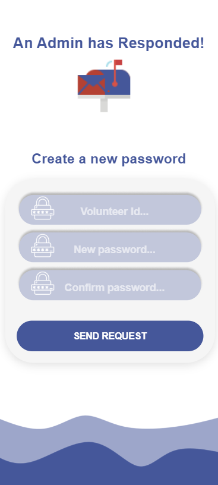| 

| Waiting                                  | Profile Accomplishments                          | Profile Training Stats                               |
| --------------------------------------------------- | -------------------------------- | -------------------------------------------- |
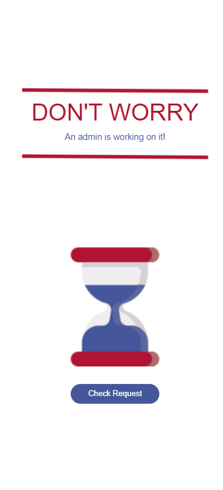 | 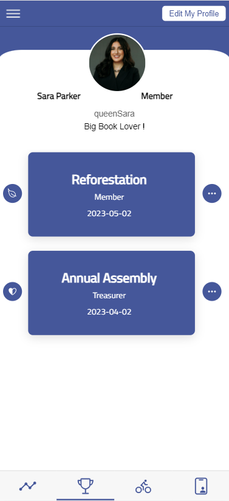 | 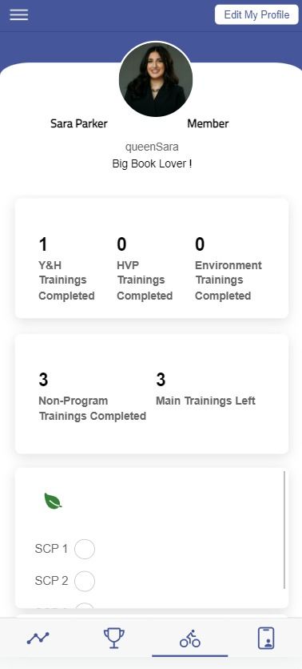 |

|  Profile Stats                                  | Profile Post                         | Announcements                              |
| --------------------------------------------------- | -------------------------------- | -------------------------------------------- |
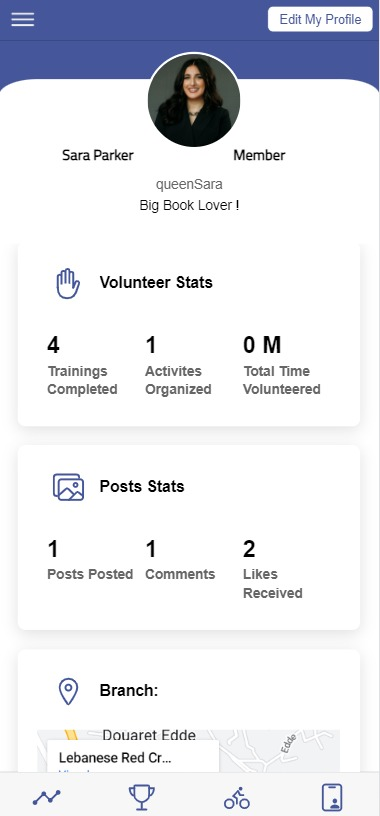 | 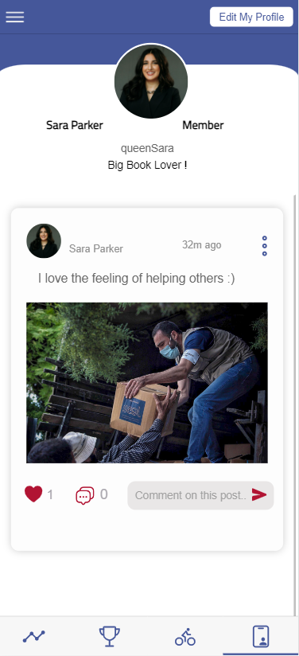 | 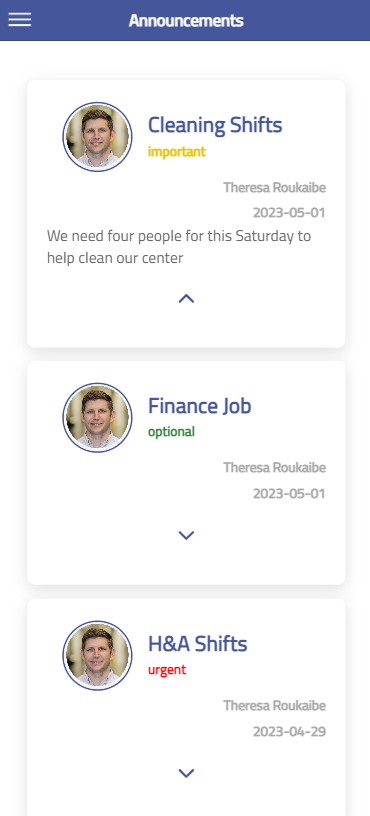 |

| Yearly Goals                                  | Gallery                        | Gallery Info                              |
| --------------------------------------------------- | -------------------------------- | -------------------------------------------- |
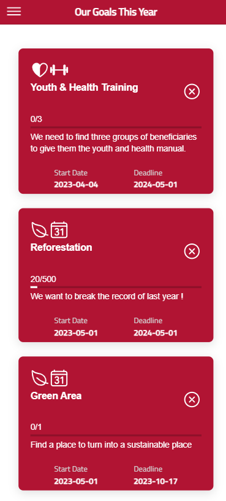 | 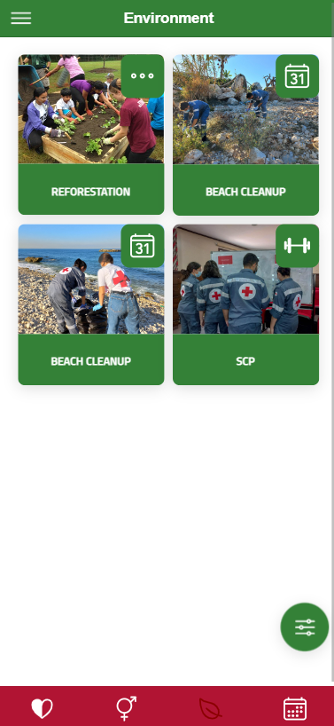 | 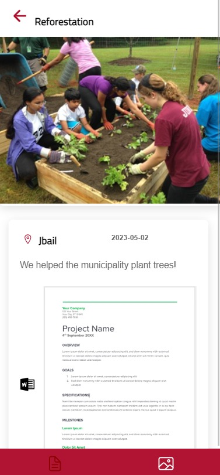 |

### Admin Panel

| Home Screen                                 | Admin Login                              |
| --------------------------------------------------- | -------------------------------- | 
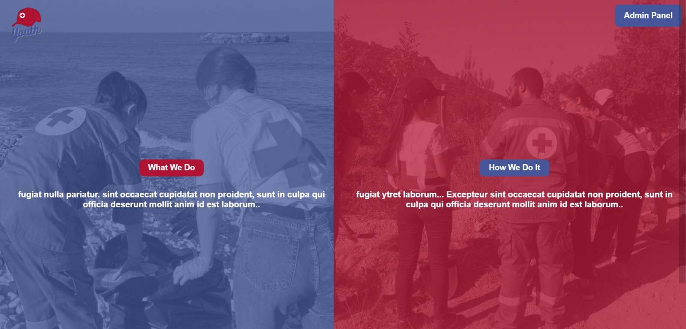 |  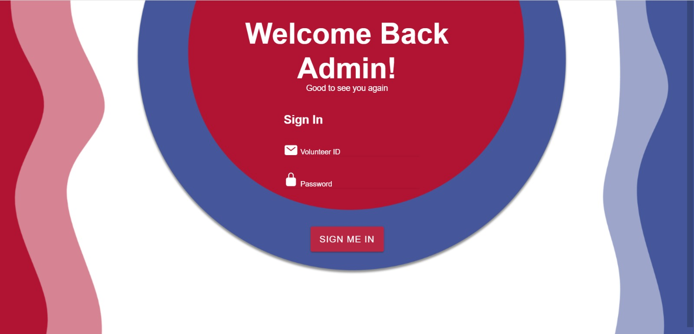|

| View Members                                 | Edit Member                              |
| --------------------------------------------------- | -------------------------------- | 
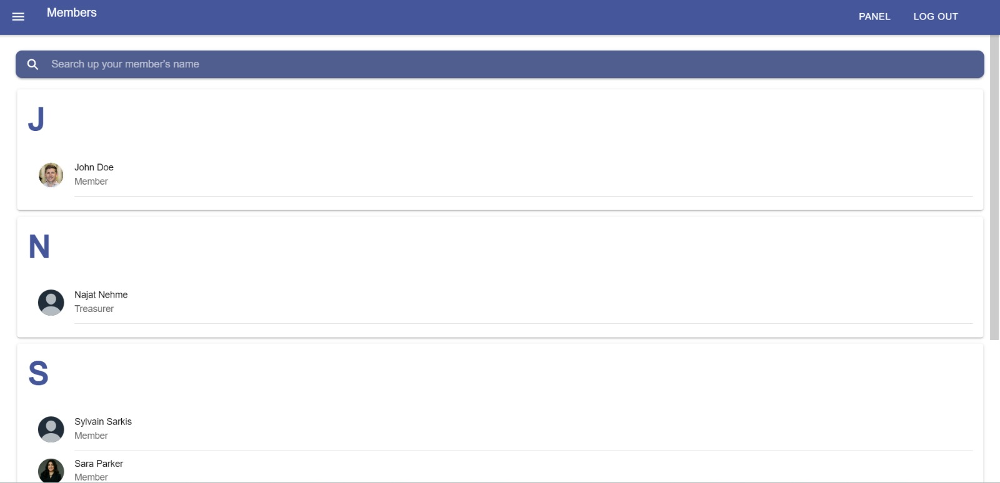 |  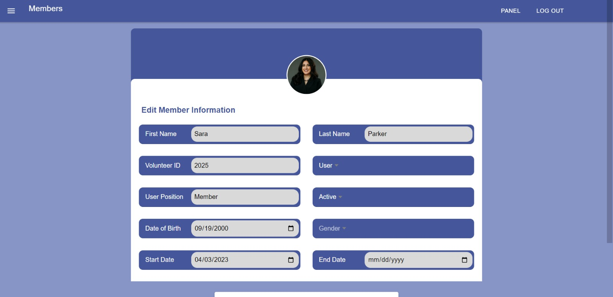|

| Add Trainings                                | Announcements                              |
| --------------------------------------------------- | -------------------------------- | 
 |  |

| Set yearly Goals                                | Requests                              |
| --------------------------------------------------- | -------------------------------- | 
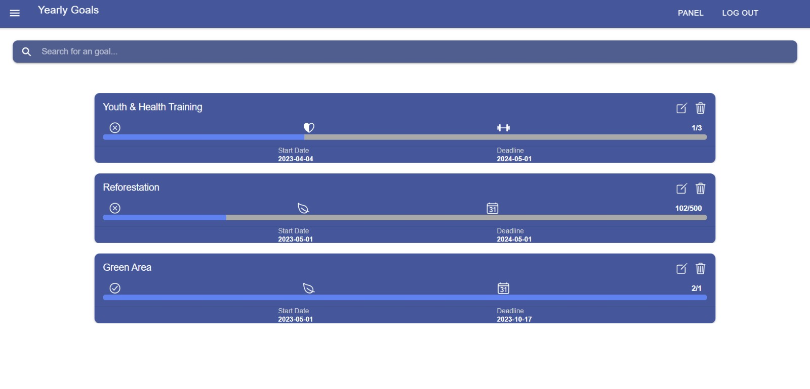 |  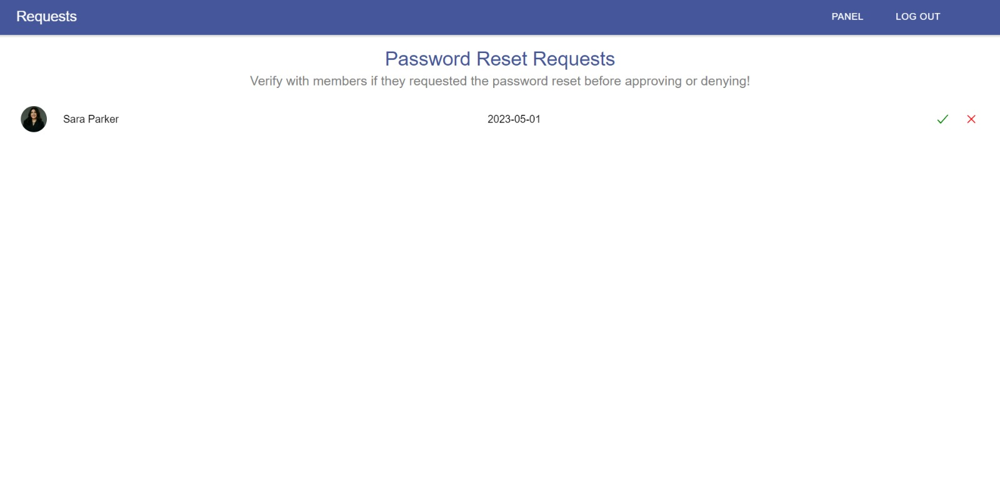|

# Stacks 

Languages  

  

  

Frameworks 

  
  

Databases  
  

# Useful Links :link:
<a href="https://ghantoos7.github.io/LRCY/BackEnd/">API Documentation</a> 
 Tutorial Videos: <a href="">Link to the videos</a>  
 Software Requirement Specification: <a href="">Link to the documents</a>  
<a href="#entity-relationship-diagram"> Entity Relationship Diagram</a>

# Contributors 

 <a href="https://github.com/Ghantoos7">Georgio Ghnatos</a>  
<a href="https://github.com/TheresaRoukaibe">&nbsp;Theresa Roukaibe</a>  
<a href="https://github.com/NajatN">&nbsp;Najat Nehme</a>  
<a href="https://github.com/Joe-Wehbe">&nbsp;Joe Wehbe</a>   

<h1 id="entity-relationship-diagram">ER Diagram :chart_with_upwards_trend:</h1>

# Application Tutorial :iphone:

# Admin Panel Tutoral :computer:
